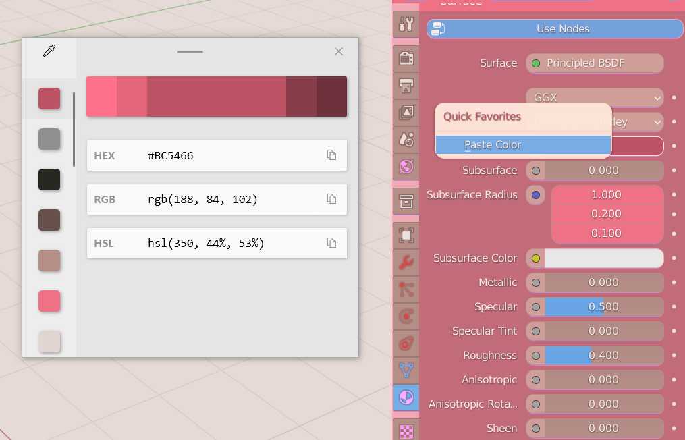

## ColorPaster [Blender Addon]

> Convert three types of color in your clipboard and paste it to the color property (gamma correct)

### **How to Use**

> Hover your mouse on the color property,F3 search color paste, then bind it to short cut or quick favorite.
>
> Copy your color from your favorite picker or website, then paste it with your quick favorite

### Format Support

+ Hex : '#' is not necessary 
  + FFFFFF
  + \#FFFFFF
+ RGB :uppercase letter & space after ',' is not necessary. Allow to pick RGBA
  + 123,251,20
  + 123, 251, 20
  + rgb(123,251,20)
  + rgb(123, 251, 20)
  + rbga(123, 251, 20, 1)
  + RGBA(222, 33, 55, 0.5)

